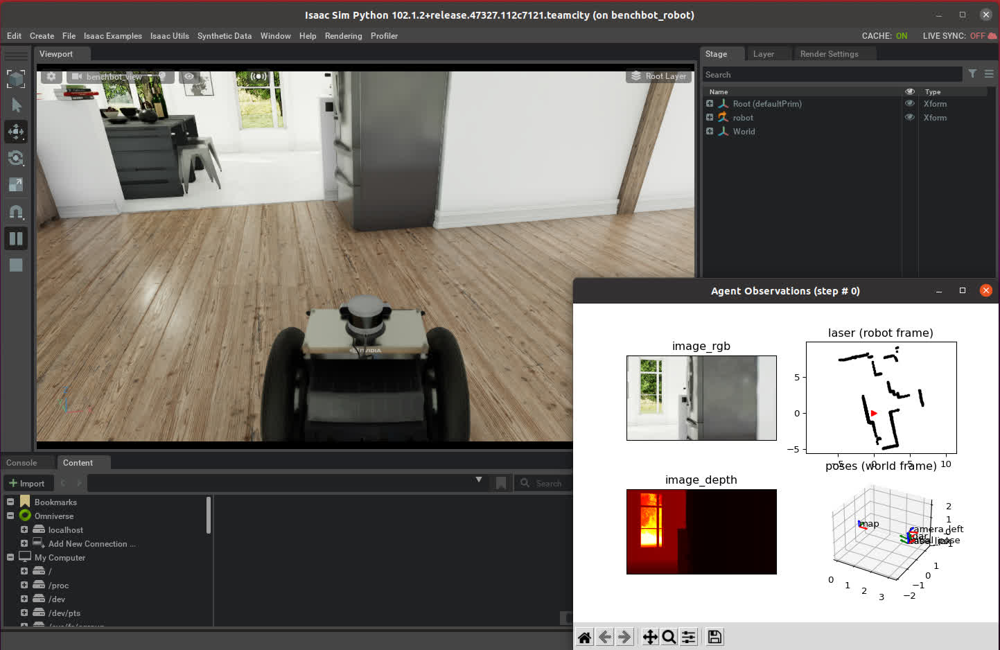

**NOTE: this software is part of the BenchBot software stack. For a complete working BenchBot system, please install the BenchBot software stack by following the instructions [here](https://github.com/qcr/benchbot).**

# BenchBot Simulator for Omniverse-powered Isaac Sim

[](http://benchbot.org)
[](https://qcr.github.io)

[](./LICENSE.txt)



The BenchBot Simulator bindings for Omniverse-powered Isaac Sim provide a simple `run` script that makes powerful photorealistic simulations available in ROS, and controllable through a basic HTTP API.

Through a single script, this package provides:

- creation of, and management of, a running [Omniverse-powered Isaac Sim](https://developer.nvidia.com/isaac-sim) instance
- a simple HTTP API for programmatically loading environments, placing robots, and controlling simulations
- ROS topics for common mobile robot topics: transforms, odometry, command velocity, RGB images, depth images, laser scans

The configuration is currently Carter specific, but could easily be extended in the future to target other robots. Also all simulator interactions come from a simple Python script that could be used as a starting point for more complex projects.

## Installation

**Please see the note at the top of the page; the BenchBot ecosystem contains much more than just these bindings**

There is no physical installation step for these bindings, simply install Isaac Sim, clone this repository, and install Python dependencies:

1. Follow the instructions on the [NVIDIA Isaac Sim documentation site](https://docs.omniverse.nvidia.com/app_isaacsim/app_isaacsim/overview.html) for [installing Isaac Sim](https://docs.omniverse.nvidia.com/app_isaacsim/app_isaacsim/install_basic.html)
2. Clone this repository:
   ```
   git clone https://github.com/qcr/benchbot_sim_omni
   ```
3. Install declared Python dependencies:
   ```
   pip install -r ./.custom_deps
   ```

## Running and using the simulator bindings

Simulator bindings are run through the `run` script, which will start a blank instance of the simulator with the HTTP API bound on port 10001 by default:

```
./run
```

A simulation in environment `my_env.usd`, with robot `my_robot.usd` at position `(0,0,0)` and quaternion (w,x,y,z) `(1,0,0,0)` can then be started by the following two CURL commands:

```
curl localhost:10001/open_environment \
 -H "Content-Type: application/json" \
 -d '{"environment": "my_env.usd"}'

curl localhost:10001/place_robot \
 -H "Content-Type: application/json" \
 -d '{"robot": "my_robot.usd", "start_pose": "1,0,0,0,0,0,0"}'
```

Full documentation of configuration options and HTTP API routes is available through the script's `--help` flag:

```
user@pc:~/benchbot_sim_omni/$ ./run --help

run -- BenchBot simulator daemon for Omniverse-powered Isaac Sim

USAGE:

    Start the daemon:
        run
        run -p /path/to/python.sh -P 8080


    Print this help information:
        run [-h|--help]

OPTION DETAILS:

    -h, --help
            Show this help menu.

    -P,--port
            Port the daemon will bind to. Default port of 10001 will
            be used if not provided.

    -p,--python-sh-path
            Path to the 'python.sh' environment script included with your Isaac
            Sim installation. Will recursively search for the script in the
            current directory if this flag is not provided.


INTERACTING WITH THE DAEMON:

    The daemon responds to HTTP requests.

    Following routes are supported:

    /
            Returns a greeting message

    /open_environment
            Opens a new environment, with USD path specified via 'environment'
            data field

    /place_robot
            Places a robot at a specified pose. Robot USD is specified via
            'robot' data field, and start pose via a comma-separated 7-tuple in
            the 'pose' field. Format for pose is:

                    quat_w,quat_x,quat_y,quat_z,pos_x,pos_y,pos_z

    /start
            Starts a simulator instance (happens by default when first opened)

    /stop
            Stops a currently running simulator instance if it exists

    /restart
            Restarts the entire simulator (generally not needed)

FURTHER DETAILS:

    Please contact the authors of BenchBot for support or to report bugs:
        b.talbot@qut.edu.au

```

## Using this simulator with the BenchBot Robot Controller

The [BenchBot Robot Controller](https://github.com/qcr/benchbot_robot_controller) is a wrapping ROS / HTTP hybrid script that manages running robots and their required subprocesses. It is ultimately fed configurations from [BenchBot add-ons](https://github.com/qcr/benchbot_addons) through our [BenchBot supervisor](https://github.com/qcr/benchbot_supervisor) service.

These details are superfluous to these BenchBot simulator bindings, but are provided here for context. This context may be helpful if looking for examples of more complex interactions with the simulator bindings. For example, the `carter_sim_omni.yaml` file in the [robots_sim_omni](https://github.com/benchbot-addons/robots_sim_omni) BenchBot add-on may be of interest.
